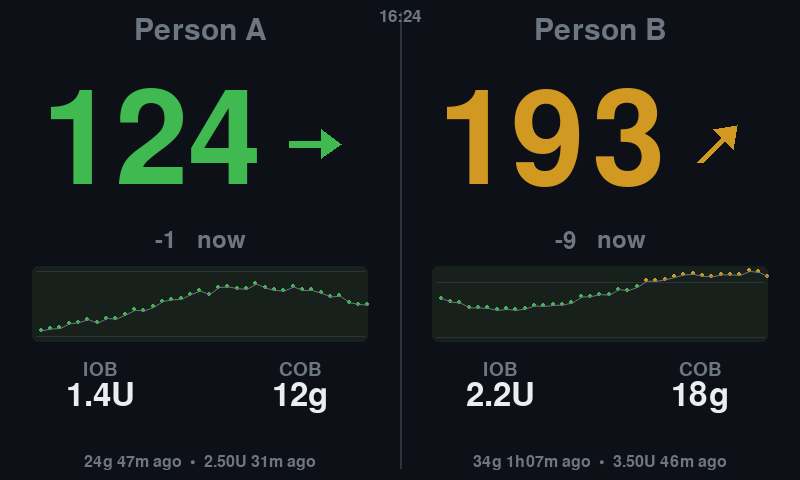

# GlucoCube

A wall-mounted glucose dashboard for two (or more) people. It boots
straight into the display — no desktop environment — and shows each person's
current glucose, trend, a 3-hour history chart, a 2-hour forecast, insulin on
board, carbs on board, and recent treatments.

It ships as **two devices from one repository**: a Raspberry Pi with the
official 7" touchscreen, and firmware for an ESP32-S3 board with a 5" panel
that costs a fraction of one. They are peers, not a device and its satellite
— the ESP32 fetches its own data over TLS and needs no Pi anywhere. Every
number that decides what a person sees lives in one file
([`glucocube/contract.py`](glucocube/contract.py)) and is compiled into both,
so the two screens are the same dashboard rather than two that resemble each
other.



## Features

- **Per-person data sources** — each person's data can arrive by:
  - **Push**: point a [Trio](https://github.com/nightscout/Trio) (or any
    Nightscout uploader) at the Pi — it speaks a minimal Nightscout v1 API,
    one port per person
  - **Pull from Tidepool** — for the twiist AID system, which uploads to
    Tidepool automatically; readings, boluses, carbs, IOB/COB, and pump
    settings all come across
  - **Pull from a Nightscout site** — for people with an existing cloud
    Nightscout; API secrets and access tokens both work (auto-detected)
- **Glucose forecast** — a 2-hour forecast curve with a confidence band on
  every chart, plus the projected value 2 hours out: uses the AID system's
  own prediction when available (Trio's `predBGs`, Loop's `predicted`),
  otherwise runs an oref0-style model (exponential insulin activity,
  deviation-based carb absorption) with therapy settings pulled from the
  person's Nightscout profile or Tidepool pump settings. Estimates are
  marked with `~`.
- **Web app** — the same dashboard in any browser, auto-refreshing,
  responsive, with light/dark themes. Settings (people, sources, thresholds)
  and a sync log are managed from the browser too; no SSH needed after
  install. Works great through a Cloudflare tunnel.
- **Touchscreen controls** — tap the sun/moon on the display for light or
  dark, and **SETTINGS** beside it to pop a QR code that opens the
  settings page on a phone, already signed in. The panel is read directly
  from `/dev/input`, so both work on the ready-made image as well as on a
  manual install; the theme switch is on the settings page too.
- **Update channels** — standard releases, or beta with the pre-releases
  as well; switching channels moves the device onto that channel's newest
  release straight away.
- **Per-person thresholds** — low/high/urgent ranges per person, with
  global defaults.
- **mg/dL or mmol/L** — chosen under **Settings → Ranges**, or followed from
  a paired GlucoCore account. Readings, the change since the last one, the
  forecast and the chart's band all read in it, on the display and in the
  web app. Everything stored stays mg/dL, `/api/dashboard.json` included, so
  switching converts what is shown rather than moving any threshold.
- **Guided setup from a phone** — a fresh device shows a QR code that opens
  a step-by-step wizard: Wi-Fi, where in the world it is so the clock is
  right, and the pairing code from GlucoCore that says who it shows, one
  question per screen. Credentials are
  tested before they're saved, and nothing is written until the last step.
  With no network at all the device opens its own setup hotspot — join it
  and the wizard opens by itself, no second QR code to scan. Once a network
  is chosen the device reboots onto it and shows its new address (also
  reachable as `http://glucocube.local/` on the ready-made image).

## Install

### Option A: flash the ready-made image

Grab `glucocube-<version>.img.xz` from the
[releases page](https://github.com/The-Carted-Horse/SugarCube/releases),
flash it with Raspberry Pi Imager (or `dd`), boot the Pi, and follow the
QR codes on screen. That's the whole install.

(Images and firmware are both built by the `Build and release` GitHub
Actions workflow, which runs on every push to `main` — see
[Cutting a release](#cutting-a-release).)

### Option B: flash an ESP32-S3 board

Open **[the web installer](https://the-carted-horse.github.io/SugarCube/flash/)**
in Chrome, Edge or Opera on a desktop, plug the board in over USB, and press
Install. Nothing to download and nothing to install first.

Two boards are supported today, both 800×480 with capacitive touch,
16 MB of flash and 8 MB of PSRAM:

| Board | Notes |
|---|---|
| Sunton **ESP32-8048S050** | 5" panel, off the shelf, about a tenth of a Pi setup |
| **SugarCube ESP32-S3** | the purpose-built board |

Or write it by hand from the
[releases page](https://github.com/The-Carted-Horse/SugarCube/releases):

```bash
esptool.py --chip esp32s3 write_flash 0x0 \
    glucocube-esp32-8048s050-<version>-factory.bin
```

Either way the panel lights and shows a QR code; scanning it opens the same
setup wizard the Pi shows. See [`firmware/`](firmware/) for how it is built,
which board profile is which, and what the Pi does that it does not (ambient
mode, and push sources).

### Option C: install on an existing Raspberry Pi OS

Use Raspberry Pi OS **Lite** (no desktop needed):

```bash
curl -sSL https://raw.githubusercontent.com/The-Carted-Horse/SugarCube/main/install.sh | bash
```

The installer handles everything: dependencies, config with random secrets,
console screen-blanking, and a systemd service that starts on boot. It
finishes by printing the URL and API secret for each person's uploader.

## Connecting the data

- **Trio (push)**: in Trio, Settings → Services → Nightscout, set URL
  `http://<pi-ip>:<port>` and the person's API secret (both shown by the
  installer and on the web settings page).
- **twiist**: the wearer links their My twiist Portal account to a free
  [Tidepool](https://www.tidepool.org) account (one-time), then enter the
  Tidepool login in the web settings under their data source.
- **Nightscout**: enter the site URL and its API secret or access token.
- **GlucoCore**: three ways in, under **Settings → GlucoCore** or during
  guided setup, and they end in the same place.
  - **Scan it.** An unpaired display asks GlucoCore to pair it and shows the
    request as a QR code, on its own screen and on the settings page. Scan it
    with a phone that is signed in, choose who the display shows, approve —
    and it pairs itself. Nothing is typed at the display, and it never
    handles the account password. The code on the wall carries a request id
    and nothing else; the secret that collects the token stays on the device.
  - **Sign in on the display.** Email and password, used once to create the
    display in GlucoCore. Only the read-only device token is kept.
  - **Type a pairing code.** In GlucoCore, open **Devices** and create one:
    six digits, ten minutes, single use.

  Pairing adds those people to the display — anyone already fed by Trio,
  twiist or Nightscout keeps the source they have. Who appears, what they are
  called and their ranges then follow what GlucoCore says. Unpairing turns
  them back into uploader-fed people, each with their own port and API
  secret.

## The web app

Everything is served on plain HTTP port 80 — open `http://glucocube.local/`
(or the IP shown on the device's screen; HTTP Basic auth, login shown
there too). Every QR code the device puts on its screen carries the login
with it, so scanning one opens the page signed in — tap **SETTINGS** in
the footer of the display to get one for the settings page. The password
is printed under each code for anyone typing the address by hand.

The installer sets a random password, and **Access** can turn it off
again: on a home network you trust, the device is only reachable from
that network, and no password means nothing to look up on a phone. Then
the settings hub stops asking you to set one. On a network guests,
flatmates or an office share, keep it.

The `.local` name needs mDNS — iPhones, Macs, Windows, and Android 12+
all resolve it; on older Android type the IP instead. When port 80 isn't
available (e.g. running by hand on a dev machine) it falls back to 8080.

| Path | What |
|---|---|
| `/` | Live dashboard (auto-refreshes every 30s) |
| `/setup` | Guided setup, one question per screen |
| `/settings` | Everything else, one page per thing |
| `/log` | Sync activity from every data source |
| `/screen.png` | What the physical screen shows right now |
| `/api/dashboard.json` | The dashboard's data, as JSON |

Settings is a hub rather than one long form, and it reads as a status
report rather than a table of contents: each row leads with what is true
now — the reading each person's panel is showing, `70–180`, `Sabanis`,
`07:57` — and only then opens the short page that would change it. The
rows are grouped into who it's for, the display and this device, under a
live view of the screen itself. Anything that needs attention is one
tappable line at the top that goes straight to the fix.

Every person has their own page, and the credentials for a data source
live inside the card for that source, so the answer to "where do I type
the password?" is "in the thing you just picked". Saving restarts the
display (a few seconds); the page says so before you press it, counts
what you have changed, and waits for the new process to answer rather
than guessing at a reload.

Settings, the dashboard and the physical screen share one visual
language — Space Grotesk for values, JetBrains Mono for labels, and the
display's own palette — so a number is the same colour on the phone as it
is on the device.

| Page | What is on it |
|---|---|
| `/settings/screen` | Live view of the physical screen, and Day/Night |
| `/settings/people` | Everyone, with their current reading |
| `/settings/person` | One person: name, source, credentials, own ranges |
| `/settings/glucocore` | Pair this display with a GlucoCore code, or unpair it |
| `/settings/ranges` | mg/dL or mmol/L, in-range and urgent thresholds, staleness, with a preview of how the screen will colour |
| `/settings/network` | Wi-Fi: what it is on, and what else is nearby |
| `/settings/clock` | Time zone (with what your phone thinks it is) |
| `/settings/weather` | Whether the ambient screen shows a temperature, and where from |
| `/settings/updates` | Version, release channel, install |
| `/settings/access` | Password (or none at all), and a link that opens settings without logging in |

## Wi-Fi setup

A device with no network opens its own `GlucoCube-Setup` hotspot and shows
a QR code that joins a phone to it. Once the phone is on that hotspot the
setup page opens by itself — the device answers the connectivity check
every phone makes on joining a network, which is what makes the "sign in
to network" sheet appear. The page lists the networks the device saw
before the hotspot came up: tap one, or choose **Other network** for a
hidden or out-of-range one, and enter the password (with a Show button,
so you can check it before committing).

The hotspot drops while the device tries to connect, so the phone loses
that page; that is expected. If the join succeeds the device reboots, its
screen shows the new address, and reopening setup picks up where you left
off. If it fails, the hotspot comes back within a minute or two and **the
reason appears both on the device's own screen and at the top of the page**
(wrong password, network not found, and so on) — no SSH needed to find out
what went wrong.

### What a paired display takes from GlucoCore

Who it shows and in what order, what they are called, the in-range and
urgent bands, the time zone, the clock format, the staleness cutoff — and
the backlight: a daytime brightness and a dimmer night-time one, with the
hours between which the night figure applies (equal hours mean never).
Dimming needs a panel with a backlight under `/sys/class/backlight`, which
the official 7" display has and an HDMI monitor does not; without one the
setting is simply ignored.

It also takes how the people share the screen, and the art behind them —
see [Ambient mode](#ambient-mode). A background chosen in GlucoCore is
fetched once and kept, so a display redraws from its own copy and only
re-downloads when the picture actually changes.

GlucoCore can still send settings this display does nothing with — the
alert toggles, because this is not an alarm device (see
[Safety note](#safety-note)). Each config push logs what it did not apply,
so "I changed it and nothing happened" has an answer in
[`/log`](#the-web-app).

### Ambient mode

A second way to draw the screen, for a display that lives on a nightstand
or a desk rather than a kitchen wall: **one person at a time, full-bleed,
over a background**, with the time and the weather in the corner and
everything else anchored out of the middle so the picture stays visible.
The two-panel dashboard is unchanged and is still what a display shows by
default; **Settings → The screen** switches between them, and a tap on the
ambient screen brings the usual footer back for a few seconds so the
sun/moon and the settings QR are still one press away.

Backgrounds come from three places: ten the device carries itself — four it
draws, and six bundled photographs (ferns, Half Dome at night, an aurora, a
pier at dusk, surf, dunes; each under its own license, see
[`glucocube/wallpapers/COPYING`](glucocube/wallpapers/COPYING)) — anything
uploaded on a person's settings page, and anything chosen in GlucoCore. A
person can have their own, the display can have one for everyone else, and
a person can be set to *nothing* — which is not the same as unset, and is
how you keep a picture off one person on your own wall when they have
chosen one for themselves.

The art is dimmed, by a figure you set, and dimmed further overnight. That
is not a style choice: the reading has to stay readable over whatever is
behind it. For the same reason the border carries the glucose state
whatever the picture is doing, a stale reading still goes grey and drops
its arrow, and **an urgent reading holds the screen** rather than taking
its turn — see the [Safety note](#safety-note).

The weather is off until you say where the device is, under
**Settings → Weather**. It asks [Open-Meteo](https://open-meteo.com/),
which needs no account and no key, every fifteen minutes; a town name is
looked up once, when you save it. Guessing a location from the time zone
would need a coordinate table on the device and would confidently show the
wrong town's sky, so it does not.

### From GlucoCore's devices screen

A paired display collects the commands queued for it — on its realtime
channel when it has one, otherwise within the minute — and says what it
did with each, so the devices screen shows the outcome rather than a
silence:

| Command | On this display |
|---|---|
| Identify | Flashes a band across the screen for 30 seconds |
| Restart | Restarts the display; it comes back in a few seconds |
| Refresh now | Polls every pull source immediately |
| Clear cache | Drops stored readings and fetches again (therapy settings stay) |
| Check for updates | Runs the release check, and installs a forced release |

The heartbeat carries the version it is running and the config version it
has applied, which is what lets that screen tell a display that is behind
from one that is simply offline.

## Updates

### Upgrading from 1.x (SugarCube)

**Re-flash the card.** Version 2 renames the Python package, the service and
the paths, and 1.x's updater cannot install it: it looks for a package by the
old name. What happens when you press Install depends on how 1.x was put on:

- **From the ready-made image** — the update fails before anything is
  touched. The device carries on running 1.x, and simply never updates again.
- **From `install.sh` (a git checkout)** — do not press Install. The checkout
  succeeds, the service is left pointing at a module that no longer exists,
  and it restart-loops with no automatic way back. Recovering needs SSH.

Flashing a version 2 image is the supported route, and settings are entered
again through the setup wizard. To keep a 1.x device exactly as it is, leave
it alone — it will offer the update but cannot complete it.

The device checks GitHub for new [releases](https://github.com/The-Carted-Horse/SugarCube/releases)
every 6 hours. When one is available it shows up on the display footer, the
web dashboard, and the settings page — install it from **Settings →
Updates** (the display restarts, data is untouched). A release whose notes
contain `[force-update]` installs itself automatically at the device's next
check — use that for fixes every device should have.

### Release channels

**Settings → Updates** chooses which releases a device follows:

- **Standard** — full releases only, the ones `main` publishes. The default.
- **Beta** — the pre-releases `dev` publishes as well, for anyone happy to
  find the rough edges first.

Changing the channel installs that channel's newest release immediately,
rather than waiting for the next thing to be published. Leaving Beta
therefore steps *back* onto the last full release, which is the point: the
channel decides which releases the device runs, not just which ones it is
told about. A device that ends up on a pre-release with Standard selected
says so on the settings page, and offers the way back.

The channel is stored in `config.json`:

```json
{ "updates": { "channel": "beta" } }
```

### Cutting a release

Releases are cut by pushing, not by tagging:

- **Push to `dev`** — builds and publishes `vX.Y.Z-rc.N` as a GitHub
  *pre-release*. Devices on the Standard channel never see it; devices set
  to Beta are offered it at their next check, and the attached images can
  be flashed to try it. Each further push to `dev` bumps `N`.
- **Push to `main`** — builds and publishes `vX.Y.Z` as a full release.
  This is the one existing devices offer under Settings → Updates. It takes
  the version the `dev` rcs were rehearsing (`2.0.1-rc.3` → `2.0.1`), or
  bumps the patch number if `dev` never rehearsed one.

Each release carries both products, cut from the same commit at the same
version number:

| Asset | For |
|---|---|
| `glucocube-<version>.img.xz` | a Raspberry Pi SD card |
| `glucocube-<board>-<version>.bin` | an ESP32 already in the field, updating itself |
| `glucocube-<board>-<version>-factory.bin` | an ESP32 being flashed for the first time |
| `manifest-<board>.json` | what the [web installer](docs/flash/) reads |

The version is worked out once and handed to both builds, so an image and a
firmware on one release can never disagree about what they are.

Both create their tag at the commit that was pushed, so there is no tag to
push by hand.

For a minor or major bump — or to run either channel off another branch —
run the workflow manually and pick the part to increment and the channel.

A push that changes nothing a device runs publishes nothing: prose, the
enclosure, the test suite and tool config are excluded on both channels,
because a release whose code is identical to the last one would still be
offered to every device on it. Everything else still cuts one, `install.sh`,
the systemd units and `firmware/` included. To publish anyway, run the
workflow by hand — the exclusions apply to pushes only.

## Firmware for ESP32-S3

[`firmware/`](firmware/) is the ESP-IDF project: the board profiles, the
ported forecast, and the parity harness that keeps it honest. The short
version is that both products draw from
[`glucocube/contract.py`](glucocube/contract.py), and the forecast the C
runs is checked against the Python's own answers on every push:

```bash
make -C firmware/host_test        # builds the C on the host and compares
```

## Enclosure

[`enclosure/`](enclosure/) has a printable OpenSCAD enclosure for the 7"
display module — see `enclosure.scad` and the ready-to-slice STLs in
`enclosure/build/`. It was designed by Sarah Sabanis and is licensed
separately, under [CC BY-NC-SA 4.0](enclosure/LICENSE).

## Development

Runs on a Mac/PC in a window with fake data:

```bash
pip install pygame qrcode
python -m glucocube --demo --windowed
```

`--no-display` runs the servers headless — useful for working on the web UI,
since nothing it serves needs pygame. `--screenshot out.png` renders one
frame and exits.

If the touchscreen is mounted rotated relative to the panel, correct it
with `GLUCOCUBE_TOUCH_TRANSFORM` — a comma-separated list of `swap`,
`invx` and `invy` — in the systemd unit. `GLUCOCUBE_TOUCH=off` disables
reading the panel altogether. The runtime dependencies are `pygame` and
`qrcode`, plus `websocket-client` for GlucoCore's realtime channel — a
config change then reaches the display in seconds rather than at the next
poll, and without the package it long-polls instead. All three come from
apt on the Pi; everything else is the Python standard library.
The display and web app are typeset in
[Space Grotesk](https://github.com/floriankarsten/space-grotesk) and
[JetBrains Mono](https://github.com/JetBrains/JetBrainsMono), bundled under
the SIL Open Font License in `glucocube/fonts/`.

### Tests

The suite is standard `pytest`, and needs no hardware — the display is
rendered through SDL's dummy driver (the same one the shipped image uses),
NetworkManager and every outbound HTTP call are stubbed out, and the
end-to-end tests start `python -m glucocube` in a subprocess and talk to
it over sockets:

```bash
pip install -r requirements-dev.txt
pytest                       # the whole suite, about fifteen seconds
pytest tests/test_oref.py    # one module
pytest --cov=glucocube       # with coverage
ruff check glucocube tests   # the same lint CI runs
```

The `Tests` workflow runs all of it on Python 3.11, 3.12 and 3.13,
alongside `shellcheck` over `install.sh` and the image stage scripts and
`systemd-analyze verify` over the service units. The release build calls
that same workflow and waits for it, so nothing is published from a red
tree.

## Safety note

This is a convenience display, not a medical device. Forecasts are estimates
— even the pump-provided ones. Don't rely on it for alarms or treatment
decisions; use the CGM app's own alerts for that. The same, in operative
terms, is in [`LICENSE`](LICENSE), so that it travels with every copy.

## License

GlucoCube is free to use for personal and other noncommercial purposes,
under the [PolyForm Noncommercial License 1.0.0](LICENSE) — that covers
personal and hobby use, study and research, and use by charities, schools,
public health bodies and government, whatever their funding. Commercial use
needs written permission: open an issue to ask.

Four things in this repository are **not** under those terms:

- The **enclosure** is Sarah Sabanis's design, under
  [CC BY-NC-SA 4.0](enclosure/LICENSE).
- The **bundled fonts** in `glucocube/fonts/` stay solely under the SIL Open
  Font License 1.1. Your rights in them, commercial use included, are
  untouched by the license above — the OFL requires exactly that.
- The **bundled wallpapers** in `glucocube/wallpapers/` are photographs from
  the [elementary OS wallpaper collection](https://github.com/elementary/wallpapers),
  each solely under its own license (CC0, Unsplash, Pexels, or CC BY-SA 4.0) —
  see [`glucocube/wallpapers/COPYING`](glucocube/wallpapers/COPYING).
- The **SD card image** is Raspberry Pi OS, and every package in it keeps its
  own license. GlucoCube's terms reach only the GlucoCube layer.

The glucose forecast reimplements the exponential insulin-activity model
from [oref0](https://github.com/openaps/oref0) in Python. Raspberry Pi,
Nightscout, Trio, Tidepool, twiist, Loop and OpenAPS are their owners'
names, used here only to say what works with what.
